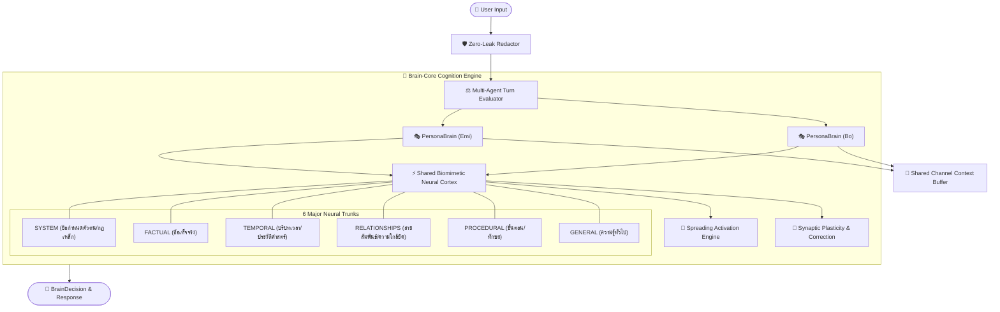

# 🧠 Brain-Core

[](https://opensource.org/licenses/MIT)
[](https://www.python.org/downloads/)
[](https://fastapi.tiangolo.com)
[](https://github.com/users/Karanztez/packages?repo_name=brain-core)
[]()

**Brain-Core** คือระบบสมองกล AI กลาง (Cognition & Reasoning Core) สำหรับสถาปัตยกรรม **Multi-Persona / Multi-Agent** ที่ออกแบบมาเพื่อแยกตัวตน, การใช้เหตุผล, ความจำ, เครื่องมือ และการสวมบทบาทระหว่างบอทหลายตัว (เช่น **น้องเอมิ**, **เฮียโบ้** หรือบอทตัวใหม่ๆ) ออกจากกันอย่างเด็ดขาด ป้องกันการจำสลับตัวตน และมาพร้อมโครงข่ายประสาทสมองจำลองชีวภาพ (**Biomimetic Neural Cortex**) พร้อมระบบความปลอดภัย **Zero-Leak Redaction** ป้องกันชื่อโมเดล AI รั่วไหล 100%

---

## 🏛️ สถาปัตยกรรมระบบ (Architecture)



---

## ✨ คุณสมบัติเด่น (Key Features)

1. **🎭 Decoupled Persona Cognition (`PersonaBrain`)**
   - แยกชุดความคิดและการตัดสินใจ (Intent Classification) ตามบริบทของแต่ละ Persona
   - ป้องกัน Persona ผสมกันหรือจำสลับตัวตนระหว่างน้องเอมิและเฮียโบ้
   - กำหนดสิทธิ์เครื่องมือ (Tool Permissions), สรรพนาม, และข้อห้ามแยกเป็นรายตัวตน
2. **⚡ Biomimetic Neural Cortex (`NeuralCortex`)**
   - โครงข่ายเส้นประสาทสมองจำลองชีวภาพแบ่งออกเป็น **6 Major Trunks**
   - **Spreading Activation Engine**: กระจายกระแสประสาทตามค่าน้ำหนัก Synapse เชื่อมโยงความจำและข้อเท็จจริงอัตโนมัติ
   - **Synaptic Plasticity**: เรียนรู้ปรับปรุงน้ำหนักเส้นประสาท และรองรับ Cognitive Correction แก้ไขความจำที่ผิดพลาดทันที
3. **🔄 Shared Channel Context Buffer (`ChannelContextBuffer`)**
   - บัฟเฟอร์กิจกรรมส่วนกลางของช่องแชท ให้บอททุกตัวรับรู้คำถามและคำตอบของกันและกันแบบเรียลไทม์
   - ป้องกันการถามหาโจทย์ซ้ำ และช่วยให้บอทรับลูกต่อจากบอทตัวแรกได้อย่างแนบเนียน
4. **🛡️ Zero-Leak Redactor (`ZeroLeakRedactor`)**
   - กรองและตัดชื่อโมเดล AI (เช่น `Gemini Vision`, `Gemini`, `GPT`, `Claude`, `DeepSeek`) ออกจากข้อความและ Discord Embeds 100%
5. **💬 Persona-Adaptive Fallbacks (`PersonaFallbackManager`)**
   - คืนค่าข้อความตอบสนองเมื่อเกิด Error / Timeout ตรงตามเพศและบุคลิกของบอท (โบ้ไม่หลุดพูด "ค่ะ", เอมิไม่หลุดพูด "ครับ")
6. **🌐 Dual Mode: In-Process Library & REST API**
   - เรียกใช้แบบ In-Process ไร้เซิร์ฟเวอร์ หรือรันเป็น HTTP Microservice ด้วย FastAPI

---

## 📦 การติดตั้ง (Installation)

### 1. ติดตั้งเป็น Python Package ตรงจาก GitHub (แนะนำ)
สั่งรันในโปรเจกต์บอทได้ทันที:
```bash
pip install git+https://github.com/Karanztez/brain-core.git
```
*(หากต้องการใช้งาน API Server ด้วย ให้ระบุ `[api]`)*:
```bash
pip install "git+https://github.com/Karanztez/brain-core.git[api]"
```

### 2. ดึงคอนเทนเนอร์จาก GitHub Packages (GHCR)
รันเป็น Microservice สำเร็จรูปผ่าน Docker Container:
```bash
docker pull ghcr.io/karanztez/brain-core:latest
docker run -d -p 8000:8000 ghcr.io/karanztez/brain-core:latest
```

### 3. ติดตั้งแบบ Local Development
```bash
git clone https://github.com/Karanztez/brain-core.git
cd brain-core
pip install -e ".[api]"
```

---

## 🚀 ตัวอย่างการใช้งาน (Quickstart)

### โหมดที่ 1: ฝังตรงในตัวบอท (In-Process Mode — เร็วที่สุด ไม่ต้องมีเซิร์ฟเวอร์)

```python
from brain_core import (
    BasePersona,
    PersonaBrain,
    EMI_CONFIG,
    BO_CONFIG,
    create_standard_cortex,
    ZeroLeakRedactor,
)

# 1. สร้าง Persona และสมองประจำตัวตน
emi = BasePersona(EMI_CONFIG)
bo = BasePersona(BO_CONFIG)

emi_brain = PersonaBrain(emi)
bo_brain = PersonaBrain(bo)

# 2. วิเคราะห์ Intent แยกตามตัวตน
decision = emi_brain.decide("ช่วยหาข้อมูลสภาพอากาศวันนี้หน่อย", allow_web=True)
print(decision.intent)        # IntentType.SEARCH
print(decision.should_search) # True

# 3. ใช้งานระบบเส้นประสาทสมอง (Spreading Activation)
cortex = create_standard_cortex()
result = cortex.activate("น้องเอมิ น่ารัก")
for neuron in result.fired_neurons:
    print(f"[{neuron.trunk.value.upper()}] {neuron.content} (Activation: {neuron.activation:.2f})")

# 4. กรองข้อความรั่วไหล
redactor = ZeroLeakRedactor()
clean_text = redactor.redact("ตรวจพบโดย Gemini Vision")
print(clean_text)  # "ตรวจพบโดย [ระบบตรวจจับภาพสแกม]"
```

---

### โหมดที่ 2: รันเป็น REST API Server

สั่งรันเซิร์ฟเวอร์ได้ 2 วิธี:
```bash
# วิธีที่ 1: ผ่าน Script ตัวช่วย
python run_server.py

# วิธีที่ 2: ผ่านคำสั่ง CLI
brain-core-server
```

- เปิดดูเอกสาร Interactive API Docs (Swagger UI) ได้ที่: **`http://localhost:8000/docs`**

---

### โหมดที่ 3: เรียกใช้งานผ่าน `BrainClient` SDK (Sync & Async)

```python
from brain_core import BrainClient

# เชื่อมต่อไปยัง Server ปลายทาง
client = BrainClient("http://localhost:8000")

# เช็คสถานะเซิร์ฟเวอร์
health = client.health()
print(health)  # {'status': 'ok', 'service': 'brain-core'}

# ตัดสินใจ Intent
res = client.decide(persona_id="emi", prompt="วิเคราะห์รูปภาพนี้ให้หน่อย")
print(res["intent"], res["allowed_tools"])

# กระตุ้นเส้นประสาทผ่าน API
neural_res = client.neural_activate("โบ้ สนิทสนม")
print(neural_res["primary_insight"])

# สำหรับ Discord Bot ใน event loop แบบ Asyncio:
# decision = await client.a_decide(persona_id="bo", prompt="สวัสดีครับ")
```

---

## 📡 สรุป REST API Endpoints

| Method | Endpoint | รายละเอียด |
| :--- | :--- | :--- |
| `GET` | `/health` | ตรวจสอบสถานะการทำงานของสมองกล |
| `GET` | `/personas` | แสดงรายชื่อ Persona ทั้งหมดที่ลงทะเบียนไว้ |
| `POST` | `/decide` | วิเคราะห์ Intent, คัดเลือกเครื่องมือ และตัดสินใจการค้นหา |
| `POST` | `/redact` | กรองคำและชื่อโมเดล AI ที่อาจรั่วไหลออกจากข้อความ |
| `POST` | `/neural/activate` | กระตุ้น Spreading Activation ข้ามเส้นประสาท 6 Major Trunks |
| `POST` | `/neural/grow` | ปลูกเซลล์ประสาทใหม่ (Neuron) ลงใน Cortex |
| `POST` | `/neural/connect` | สร้างไซแนปส์ (Synapse) เชื่อมโยงระหว่าง 2 เซลล์ประสาท |
| `POST` | `/neural/correct` | ทำการแก้ไขความรู้ผิดพลาด (Cognitive Correction) |
| `GET` | `/neural/state` | ส่งออกสถานะกราฟโครงข่ายประสาททั้งหมด |

---

## 🧪 การทดสอบ (Testing)

โปรเจกต์มาพร้อมชุด Unit Tests ครอบคลุมทุกโมดูล (27/27 tests passing):

```bash
# รันผ่าน unittest
python -m unittest discover tests

# หรือรันไฟล์เดโมทดสอบทั้ง 2 โหมด
python examples/demo_modes.py
```

---

## 📄 License
MIT License - Karanztez
